# 🔄 SkillSwap - Платформа за бартер на умения

## Functional Guide

### Цел на приложението
SkillSwap е уеб приложение, което позволява на потребителите да разменят умения един с друг без пари. Например: "Предлагам 1 час урок по Python за 1 час урок по китара". Платформата свързва хора, които искат да научат нови умения като предлагат собствените си знания в замяна.

---

### Основни потребителски потоци

#### Гост потребител (без акаунт)
1. Отваря началната страница и вижда как работи платформата
2. Разглежда каталога с всички оферти
3. Филтрира офертите по категория
4. Вижда детайлите на отделна оферта
5. Не може да създава оферти или да изпраща заявки
6. Може да се регистрира или влезе в акаунт

#### Регистриран потребител (с акаунт)
1. Влиза в акаунта си с имейл и парола
2. Създава нова оферта за размяна на умения
3. Редактира или изтрива собствените си оферти
4. Изпраща заявка за размяна към друг потребител
5. Получава заявки от други потребители
6. Приема или отхвърля получените заявки
7. Управлява офертите си от профилната страница

---

### Обяснение на основните функции

#### 1. Начална страница
- Показва описание на платформата и как работи
- Съдържа секция с категории за бързо филтриране
- Обяснява процеса в 3 стъпки: Регистрирай се, Публикувай оферта, Размени умения
- Анимирано появяване на елементите

#### 2. Каталог с оферти
- Показва всички активни оферти за размяна
- Филтриране по категория: Програмиране, Музика, Езици, Дизайн, Академично, Спорт, Готварство, Фотография
- Всяка картичка показва заглавие, какво се предлага, какво се търси, автор и време
- Анимирано появяване на картичките една след друга
- Празно състояние когато няма оферти в категорията

#### 3. Детайли на оферта
- Пълна информация за офертата
- Ясно показва какво се предлага и какво се търси
- Регистрираните потребители виждат бутон "Предложи размяна"
- Собственикът вижда бутони за редактиране и изтриване
- Гостите виждат покана за вход

#### 4. Създаване на оферта
- Форма с пълна валидация
- Полета: заглавие, категория, какво предлагаш, какво търсиш, описание
- Показва грешки в реално време под всяко поле
- Достъпна само за регистрирани потребители

#### 5. Редактиране на оферта
- Формата се зарежда с текущите данни
- Само собственикът може да редактира офертата
- Същата валидация като при създаване

#### 6. Система за заявки за размяна
- Потребителят изпраща заявка с лично съобщение
- Собственикът получава заявката в страницата "Размени"
- Два таба: Получени и Изпратени заявки
- Статуси: Изчакване, Приета, Отхвърлена
- Само собственикът може да приема или отхвърля заявки

#### 7. Потребителски профил
- Показва името и имейла на потребителя
- Списък с всички оферти на потребителя
- Бързи действия: виж, редактирай, изтрий

---

### Как потребителят взаимодейства със системата

#### Регистрация и вход
1. Натисни "Регистрация" в навигацията
2. Въведи име, имейл и парола (минимум 6 символа)
3. Потвърди паролата
4. След успешна регистрация автоматично влизаш в системата
5. При следващо посещение използвай "Вход" с имейл и парола

#### Създаване на оферта
1. Влез в акаунта си
2. Натисни "Нова оферта" в навигацията
3. Попълни заглавието на офертата
4. Избери категория от падащото меню
5. Опиши какво предлагаш и какво търсиш
6. Добави подробно описание (минимум 20 символа)
7. Натисни "Публикувай оферта"

#### Изпращане на заявка за размяна
1. Намери интересна оферта в каталога
2. Натисни върху нея за да видиш детайлите
3. Натисни "Предложи размяна"
4. Напиши лично съобщение (минимум 10 символа)
5. Натисни "Изпрати"

#### Управление на заявки
1. Отиди на "Размени" в навигацията
2. В таб "Получени" виждаш всички заявки към твоите оферти
3. Натисни "Приеми" или "Откажи" за всяка заявка
4. В таб "Изпратени" виждаш статуса на твоите заявки

---

## Технологии
- **Frontend:** Angular 21 (Standalone Components)
- **Backend:** Firebase (Authentication + Firestore)
- **Стилове:** Custom CSS
- **Реактивност:** RxJS Observables
- **Анимации:** Angular Animations

## Функционалности
- ✅ Регистрация и вход на потребители
- ✅ Разглеждане на оферти за размяна на умения
- ✅ Филтриране по категория
- ✅ Създаване, редактиране и изтриване на оферти
- ✅ Изпращане на заявки за размяна със съобщение
- ✅ Приемане или отхвърляне на заявки за размяна
- ✅ Route guards за защитени страници
- ✅ Валидация на форми с user-friendly грешки
- ✅ Реално време обновяване с Firestore
- ✅ Angular Animations
- ✅ Custom TimeAgo Pipe
- ✅ Responsive дизайн

## Използвани Angular концепции
- Standalone Components
- Reactive Forms с валидация
- RxJS Observables и оператори (switchMap, combineLatest, map)
- Route Guards (authGuard, guestGuard)
- Custom Pipe (timeAgo)
- Lifecycle hooks (ngOnInit)
- Dependency Injection
- Angular Router с route параметри
- Angular Animations (trigger, transition, stagger)
- HTTP Interceptor за error handling

## 📸 Екрани снимки (Галерия)
### Начална страница
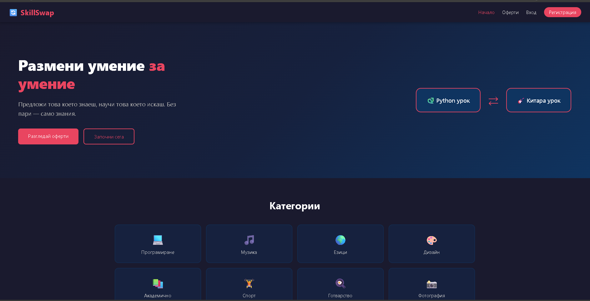
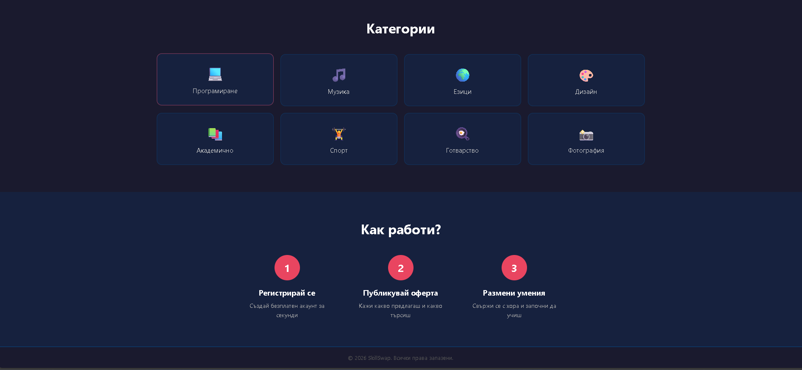
### Каталог с оферти
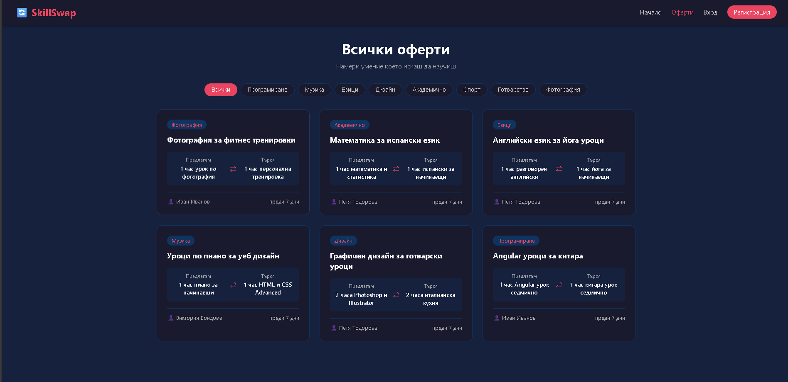
### Детайли на оферта (без логнат потребител)
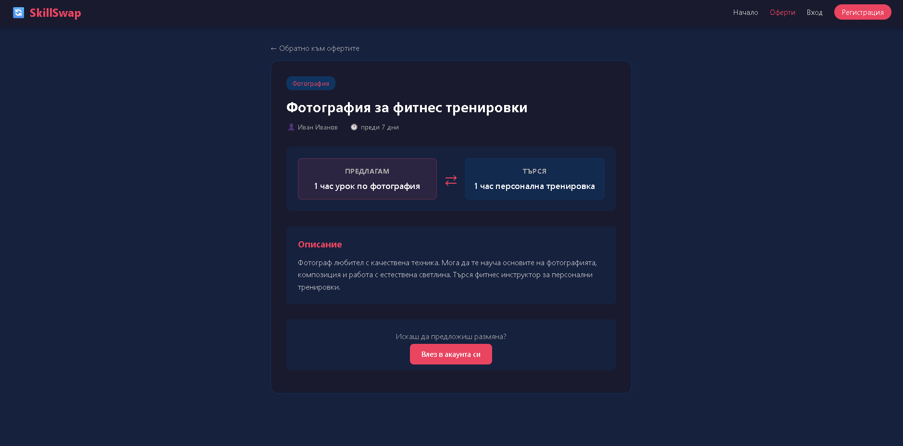
### Детайли на оферта (с логнат потребител - собственик)
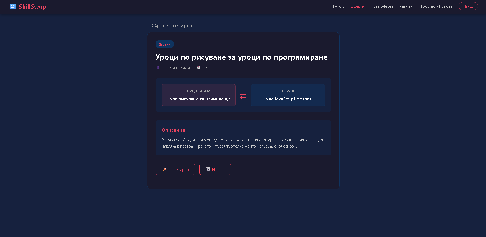
### Детайли на оферта (с логнат потребител - друг потребител)
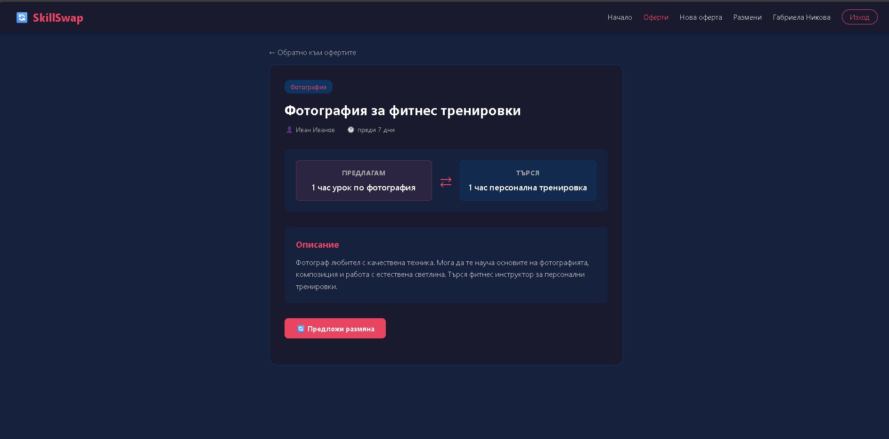
### Вход и регистрация
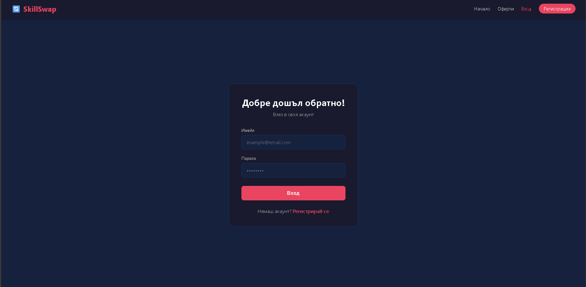
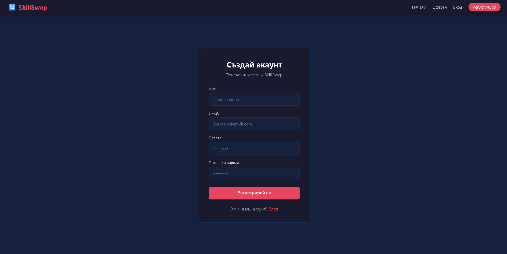
### Създаване и редактиране
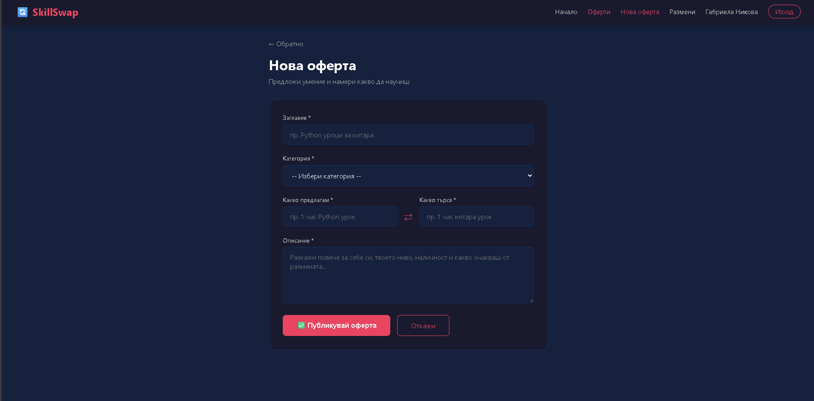
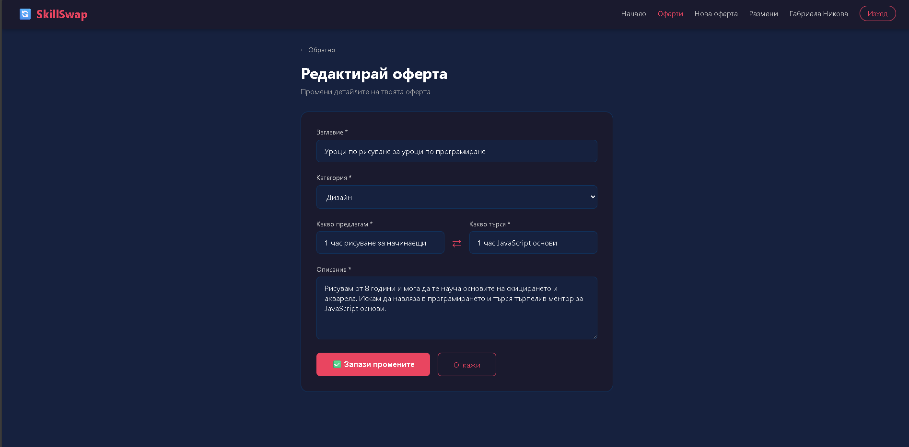
### Профил
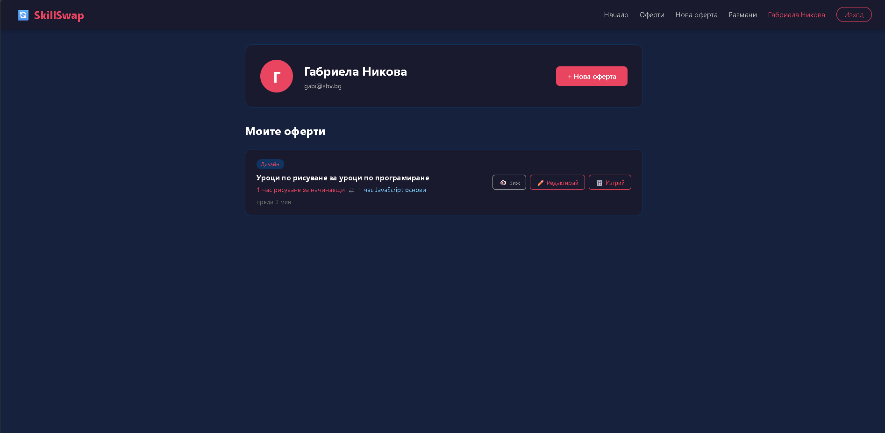
### Размени
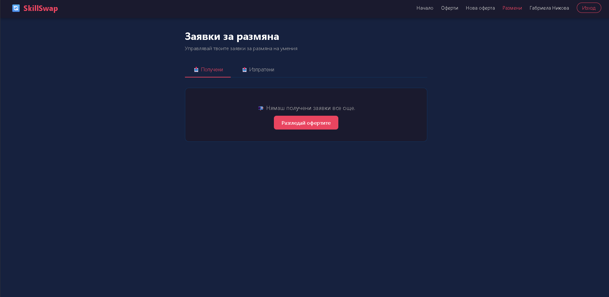
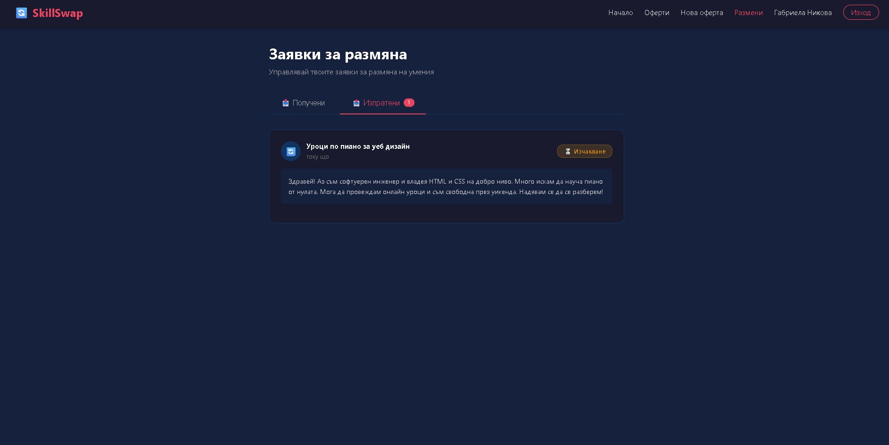

## Инсталация и стартиране

### Изисквания
- Node.js (v18+)
- Angular CLI

### Стъпки
1. Клонирай репозиторито:
```bash
git clone https://github.com/victoriabondova/skill-swap.git
cd skill-swap
```
2. Инсталирай зависимостите:
```bash
npm install --legacy-peer-deps
```
3. Стартирай приложението:
```bash
ng serve
```
4. Отвори браузъра на:
http://localhost:4200


## 👩‍💻 Автор
**Виктория Бондова**
* GitHub: [@victoriabondova](https://github.com/victoriabondova)
* Проектът е създаден с учебна цел за усвояване на Angular.